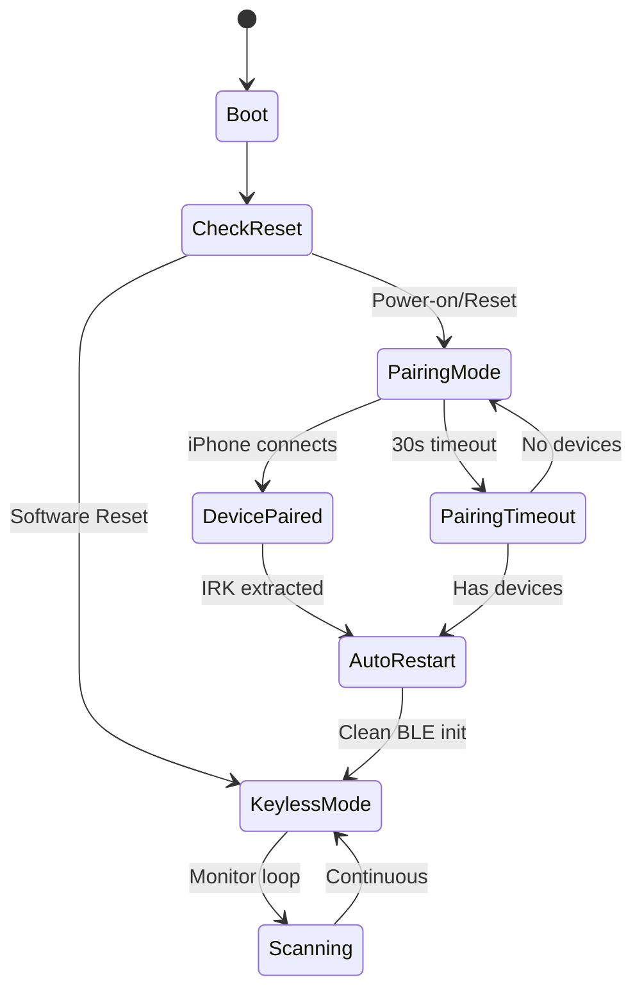

# Technical Documentation
## ESP32 Dynamic iPhone Keyless System v7

🔬 **Deep Technical Analysis and Implementation Details**

## 📡 BLE Architecture

### iPhone Privacy and RPA Resolution

The system leverages Apple's BLE privacy features for secure device identification:

#### **Resolvable Private Address (RPA) Structure**
```
RPA Format: [Prand(3 bytes)][Hash(3 bytes)]
- Prand: Pseudo-random part (includes type bits 01 in MSB)  
- Hash: AES-128 encrypted authentication hash
```

#### **IRK Resolution Algorithm**
```cpp
// Simplified IRK verification process
uint8_t input[16] = {0x00, 0x00, ..., prand[0], prand[1], prand[2]};
uint8_t aes_result[16] = AES128_encrypt(IRK, input);
uint8_t computed_hash[3] = {aes_result[15], aes_result[14], aes_result[13]};

// Compare with RPA hash (byte-reversed)
bool match = (computed_hash[0] == rpa_hash[2] && 
              computed_hash[1] == rpa_hash[1] && 
              computed_hash[2] == rpa_hash[0]);
```

### ESP32 BLE Stack Challenges

#### **Mode Transition Issues**
The ESP32 BLE stack has limitations when switching between modes:
- **Server Mode** (Advertising/GATT): Used during iPhone pairing
- **Scanner Mode** (Scanning): Used for proximity detection

**Problem**: Direct mode switching causes `esp_ble_gap_set_scan_params: err: 259`

**Solution**: Complete system restart between modes using `ESP.restart()`

#### **Reset Reason Detection**
```cpp
esp_reset_reason_t resetReason = esp_reset_reason();
switch(resetReason) {
    case ESP_RST_POWERON:  // Power-on or reset button
        startPairingMode();
        break;
    case ESP_RST_SW:       // Software restart (our auto-restart)
        startKeylessMode();
        break;
}
```

## 🔐 Security Implementation

### IRK Extraction Process

#### **BLE Pairing Sequence**
```
1. iPhone connects to "ESPKV7 Tracker"
2. ESP32 requests security: ESP_LE_AUTH_REQ_SC_BOND
3. PIN exchange: Fixed PIN 123456
4. Secure pairing establishes bonding
5. ESP32 extracts IRK from bond database
6. IRK stored in EEPROM with byte-order correction
```

#### **Byte Order Correction**
The ESP32 BLE stack returns IRKs in reverse byte order:
```cpp
// ESP32 returns: {0x04, 0x90, 0x01, 0xE5, ...}
// Actual IRK:    {0xF9, 0x87, 0xFE, 0xB5, ...}

// Correction algorithm
for (int k = 0; k < 16; k++) {
    correctedIRK[k] = bondData.irk[15 - k];
}
```

### Security Considerations

#### **Threat Model**
- ✅ **Proximity-based Authentication**: Requires iPhone within ~20m
- ✅ **Cryptographic Verification**: AES-128 with unique IRKs
- ✅ **Physical Access Control**: Pairing requires physical presence
- ⚠️ **Replay Attacks**: RPA rotation mitigates but doesn't eliminate
- ⚠️ **Jamming Attacks**: BLE 2.4GHz susceptible to interference

#### **Security Hardening Options**
```cpp
// Additional security measures for production
#define REQUIRE_BUTTON_PRESS     // Physical button for pairing
#define ENABLE_PIN_RANDOMIZATION // Dynamic PIN generation
#define ADD_LOCATION_VERIFICATION // GPS-based validation
```

## ⚡ Performance Analysis

### Memory Usage Breakdown
```
Flash Memory (1,310,720 bytes total):
├── Framework: ~800KB (Arduino + ESP32 core)
├── BLE Stack: ~200KB (NimBLE + ESP32 BLE)
├── Application: ~140KB (our code)
└── Available: ~170KB (future features)

RAM Usage (327,680 bytes total):
├── BLE Stack: ~25KB (heap allocation)
├── Static Variables: ~5KB (device storage, etc.)
├── Stack Space: ~8KB (per task)
└── Available: ~289KB (dynamic operations)
```

### Power Consumption Profile
```
Operating Modes:
├── Deep Sleep: ~10µA (future implementation)
├── Scanning Only: ~80mA @ 3.3V
├── Pairing Mode: ~120mA @ 3.3V  
└── Peak (TX): ~240mA @ 3.3V
```

### Detection Performance
```cpp
// Proximity detection metrics
RSSI_THRESHOLD = -80dBm;     // ~15-20m range
SCAN_INTERVAL = 1600ms;      // Balance power vs responsiveness  
SCAN_WINDOW = 800ms;         // 50% duty cycle
PROXIMITY_TIMEOUT = 10000ms; // Anti-flutter timeout
```

## 🔄 State Machine Architecture

### System States


### Device State Management
```cpp
// Per-device state tracking
struct DeviceState {
    bool nearby;                    // Currently in range
    unsigned long lastSeen;         // Last detection timestamp
    int weakSignalCount;           // Hysteresis counter
    bool isWeak;                   // Weak signal flag
};

DeviceState deviceStates[MAX_DEVICES];
```

## 🛠️ Hardware Interface

### Pin Configuration
```cpp
// Control Pins (automotive-grade switching)
const int KEY_POWER_PIN = 23;    // Transistor base (12V key fob)
const int LOCK_BUTTON_PIN = 19;  // Lock signal transistor  
const int UNLOCK_BUTTON_PIN = 18; // Unlock signal transistor
const int LED_PIN = 2;           // Status indication

// Timing Constants
const unsigned long UNLOCK_DELAY = 500ms;      // Key power → unlock
const unsigned long LOCK_STABILIZATION = 10ms; // Lock debounce
const unsigned long POWER_OFF_DELAY = 10000ms; // Key power duration
```

### Automotive Integration
```
ESP32 → Transistor → Car Key Fob Simulation

Key Fob Interface:
├── Power Rail: 12V automotive supply
├── Lock Signal: Momentary 100ms pulse  
├── Unlock Signal: Momentary 100ms pulse
└── Ground: Common automotive ground
```

## 📊 EEPROM Data Structure

### Memory Layout
```cpp
EEPROM Structure (512 bytes):
├── 0x00-0x03: Magic bytes (0xDEADBEEF)
├── 0x04-0x07: Device count (int32)
├── 0x08-0x27: Device 1 (32 bytes)
│   ├── 0x08-0x17: IRK (16 bytes)
│   └── 0x18-0x27: Name (16 bytes)
├── 0x28-0x47: Device 2 (32 bytes)
├── ...
└── 0x188-0x1A7: Device 10 (32 bytes)

Total capacity: 10 devices × 32 bytes = 320 bytes
Overhead: 8 bytes (magic + count)
Remaining: 184 bytes (future expansion)
```

### Data Persistence
```cpp
// EEPROM operations with wear leveling consideration
void saveDevicesToEEPROM() {
    EEPROM.writeULong(MAGIC_BYTES_ADDR, MAGIC_VALUE);
    EEPROM.writeInt(DEVICE_COUNT_ADDR, numKnownDevices);
    
    for (int i = 0; i < numKnownDevices; i++) {
        int addr = DEVICES_START_ADDR + (i * DEVICE_ENTRY_SIZE);
        // Write IRK and name...
    }
    
    EEPROM.commit(); // Actual write to flash
}
```

## 🔍 Debugging and Diagnostics

### Serial Debug Levels
```cpp
Debug Output Categories:
├── System: Boot, reset reasons, mode transitions
├── BLE: Pairing events, scan results, errors
├── IRK: Extraction, verification, storage  
├── Proximity: RSSI values, device detection
├── Automotive: Lock/unlock commands, timing
└── Performance: Memory usage, scan statistics
```

### Common Debug Scenarios
```cpp
// IRK Verification Debug
Serial.printf("RPA: %02X:%02X:%02X:%02X:%02X:%02X\n", addr[0]...);
Serial.printf("Computed Hash: %02X%02X%02X\n", hash[0], hash[1], hash[2]);
Serial.printf("Expected Hash: %02X%02X%02X\n", rpa[3], rpa[4], rpa[5]);

// Proximity Detection Debug  
Serial.printf("Device %s: RSSI=%d, LastSeen=%lums\n", 
              device.name, rssi, millis() - device.lastSeen);
```

### Performance Monitoring
```cpp
// Scan performance metrics
unsigned long scanStartTime = millis();
BLEScanResults results = pBLEScan->start(SCAN_TIME, false);
unsigned long scanDuration = millis() - scanStartTime;
Serial.printf("Scan: %lums, Found: %d devices\n", scanDuration, results.getCount());
```

## 🔮 Future Enhancements

### Planned Features
```cpp
// Android Support
class AndroidDevice {
    uint8_t mac_address[6];      // Static MAC for Android
    uint32_t service_uuid;       // Custom service identifier
    uint16_t manufacturer_id;    // Device manufacturer
};

// Enhanced Security
struct SecureDevice {
    uint8_t irk[16];            // iPhone IRK
    uint8_t ltk[16];            // Long Term Key
    uint32_t challenge;         // Rolling challenge
    bool requires_pin;          // Additional PIN requirement
};

// Power Management
void enterDeepSleep() {
    esp_sleep_enable_timer_wakeup(SCAN_INTERVAL_SLEEP * 1000000);
    esp_sleep_enable_ext0_wakeup(MOTION_SENSOR_PIN, 1);
    esp_deep_sleep_start();
}
```

### Architecture Scalability
```cpp
// Multi-vehicle support
struct VehicleProfile {
    char name[32];              // "Home Car", "Work Car"  
    DeviceEntry devices[MAX_DEVICES];
    uint8_t pin_config[4];      // Different pin layouts
    ProximitySettings settings; // Per-vehicle thresholds
};
```

---

**📚 This technical documentation provides the foundation for understanding, extending, and contributing to the ESP32 Dynamic iPhone Keyless System.**